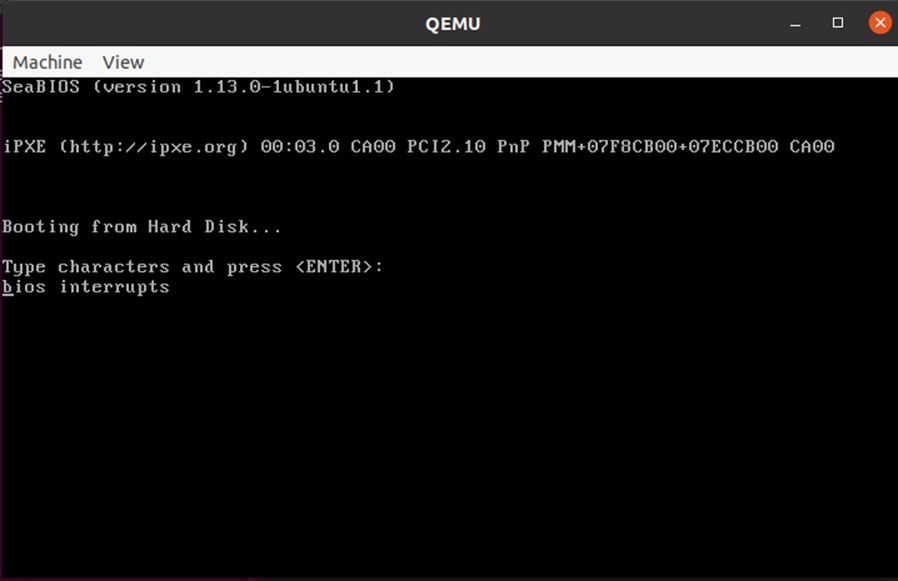
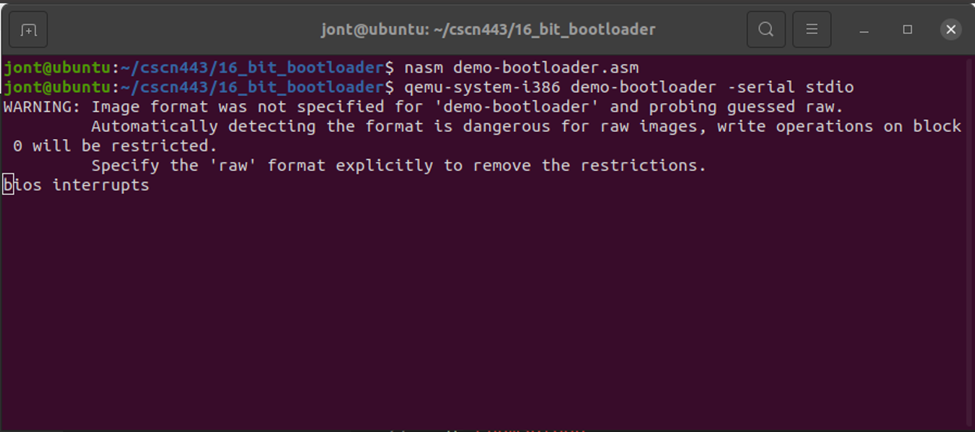

##Goal##
Capture user input using only BIOS interrupts on a x86 system via the existing keyboard buffer, waiting for a CR character to denote the end of the input, and send the contents of the keyboard buffer to the serial port. 

##Outcome##
In the images below, I utilized BIOS interrupts (int 10h, int 16h) and conditional loops to read and display keyboard input in the QEMU bootloader.  

Thought process documented in comments in the .asm file. 

