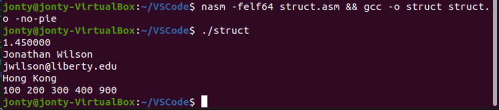

# Goal
Implement a 5-element struct in x86 assembly of varying data types. Define the struct and  write at least one function that operates on the struct and outputs the entire contents of the struct to the screen. 

The first four elements are various types - float, string, etc. The fifth element is an array of type dd, with an allocated space of 20 bytes for 5 elements, and contained the values ‘100, 200, 300, 400, 500’. This final element is accessible through the label ‘s_grade_array’. 

The modifying function’s purpose is to modify the last element in the struct array and to set it from 500 to 900. This function is called from inside the loop that prints out the array elements and is called only once the loop reaches the 4th position in the array. Once this position is reached, the program branches to a separate label ‘start_function’ where the call for the modifying function ‘edit_grades’ is executed. Once ‘edit_grades’ is called, the function moves the integer ‘900’ into the final position of the array in the struct memory location. The function then returns to its previous position within the ‘start_function’ label where it jumps back into the loop and prints out the fourth and then finally the fifth array elements.

# Outcome 
Successful program running
