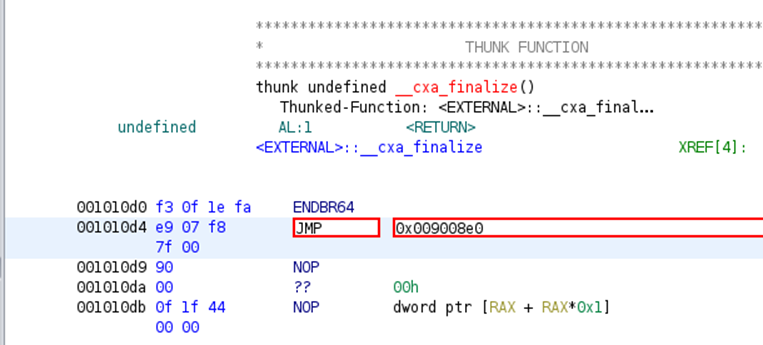
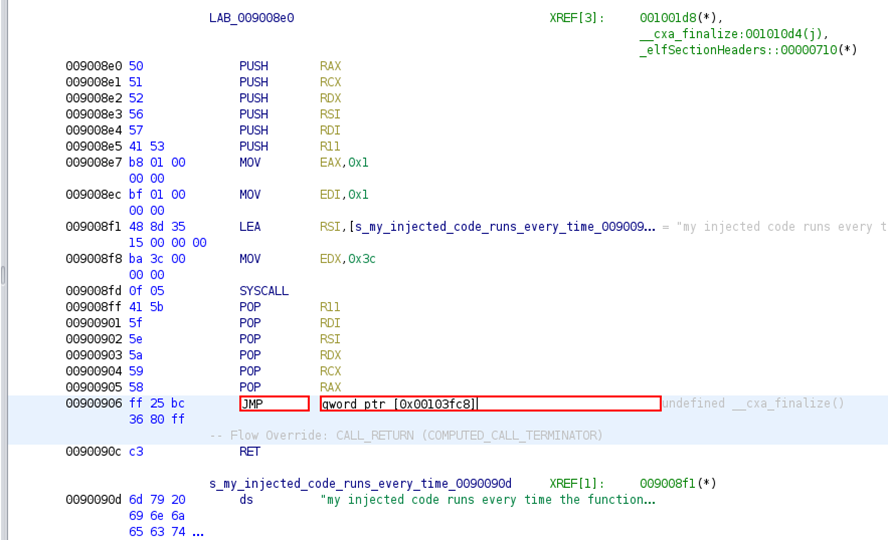
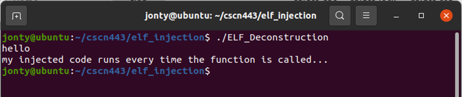

# Goal 
Use NASM to assemble the shell code (which simply makes a Linux syscall for the sys_write system call)

Inject the assembled shell code into the ELF_Deconstruction binary using a elfinject.c program.

Import and analyze the injected ELF_Deconstruction binary in Ghidra to find the offset of the injected shell code

Determine the PLT jump location for the “cxa_finalize” external function and patch the jump instruction to point to the injected shell code.

Patch the NOPs in the shell code to jump back to the original “cxa_finalize” qword ptr location.

Export the patched binary from Ghidra and change the permissions on the exported file.
Run the exported binary.

# Outcome
Patched CXA:
(JMP to injected location)

Patched Injection NOPs:
(patched to JMP to the ptr location of cxa_finalize)

Successfully running the binary:
