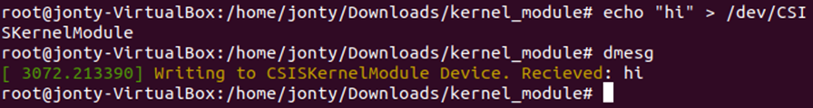

##Goal##
Implement the device_write function in a Linux kernel module that allows information to be written to the address buffer. 

##Outcome##
As seen below, I wrote data to dmesg using echo and the implemented device_write function. This was then displayed using `sudo dmesg`. 

This function is implemented between lines `64` and `77` in `CSISKernelModule.c`. 

**Identified security vulnerabilties**
The method used to write to the kernel module involved copying information from user space into kernel space. This information was stored in a temporary message buffer variable that was then printed to dmesg using the `printk()` function. There is a potential security issue with this method, as it allows the user to write whatever input they would like into kernel space. This can cause memory leaks, data overwrites, and general corruption of kernel modules if handled incorrectly by the module itself. For instance, if an attacker manages to influence kernel objects in memory, they can begin to escalate privileges, crash the system, etc. 

Therefore, the kernel needs to be able to remedy such risks to security, and one such way is to use the `copy_from_user()` function. This function provides some basic error checking, such as working with the `access_ok()` function which ensures that the user has write access, setting a limit on how much data can be copied in from user space, and returning different values depending on how much data is left to be copied (such as 0 for success). 

However, as the `printk()` function is used, which has a buffer size of 1K, this will not stop attackers from using the `copy_from_user()` function to pass to the kernel an arbitrary amount of user space data that could exceed the `printk()` buffer range. Therefore, this method is still vulnerable to attacks that can overwrite memory.