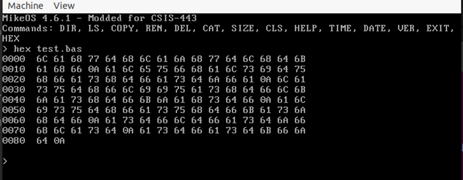

**Goal**
Create a hex viewer in MikeOS using the system calls provided by MikeOS. 

Do so by adding the HEX command to cli.asm, allowing this viewer to be called directly. 

The hex viewer prints out the hex value for the beginning of the file (starting at 0000), then prints a few spaces, then prints 16 hex values of the first 16 bytes of the file, and then start a new line. It will then wait for the user to press a key. Once a key is pressed, it will show the current hex value of the file position (now 0010) and then print another 16 hex values and then repeat. At the end of each line, the program checks to see if it has reached the end of the file. If so, it prints a new line and jumps to get_cmd. 

**Outcome**
The hex command was successfully implemented in lines `351-447` in `cli.asm` in MikeOS. I was able to successfully view the hexidecimal representation of `the test.bas` file.

Thought process documented within comments in the cli.asm file. 

