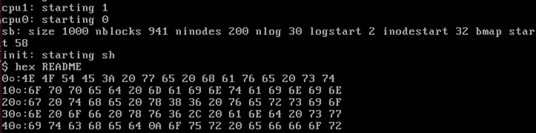

**Goal**
Create a program in xv6 that takes a file name as an argument and outputs 16 bytes per line in hexadecimal notation. Each line should include the file position in hex of each line

**Outcome**
Successful implementation. 

QEMU output:
