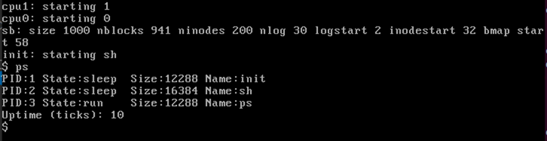

##Goal##
 Display the PID, State, Size, and the Name of each running process, and the uptime of the system using a syscall. Modify `procdump.c` and `sysproc.c` and create `ps.c` to achieve this. 

##Outcome##
Running the ps command on QEMU:
