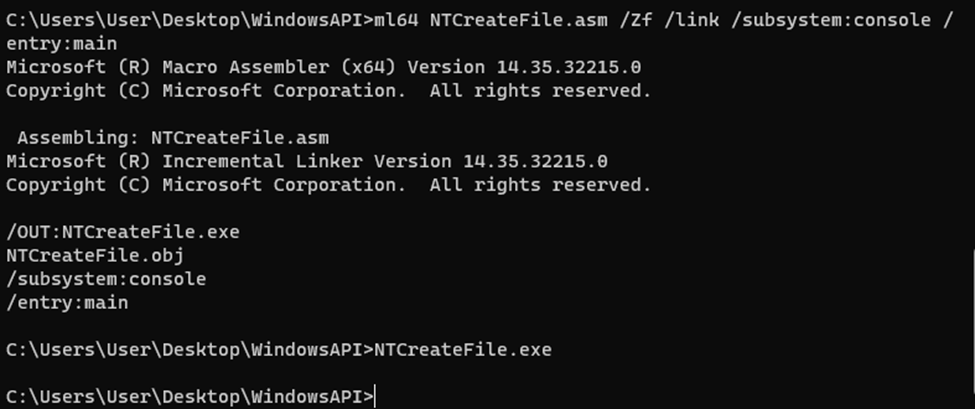
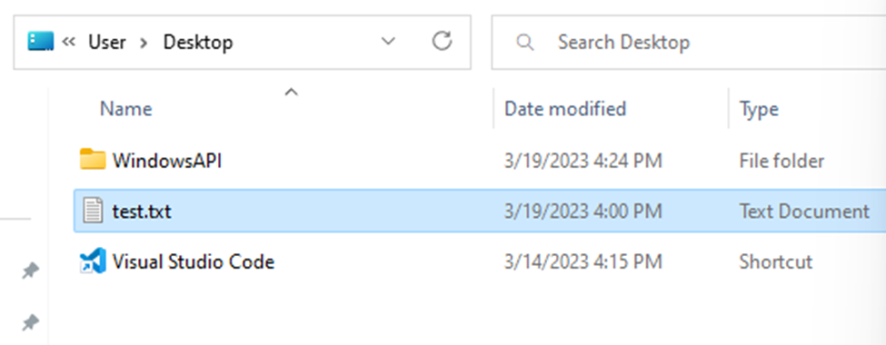
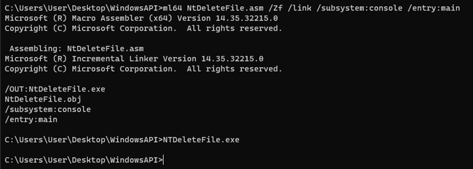
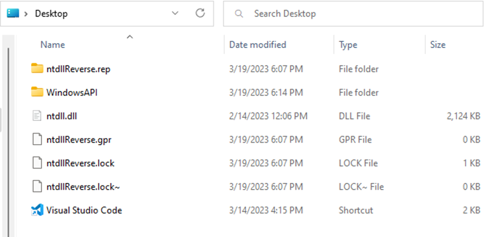

# Goal 
Modify the NTCreateFile.asm to be run on Windows 10 x86 architecture and use syscalls to both create and delete a file. 

# Outcome 
NTCreateFile.asm executed

Test.txt file created. 

NTDeleteFile.asm executed

Test.txt file deleted.

