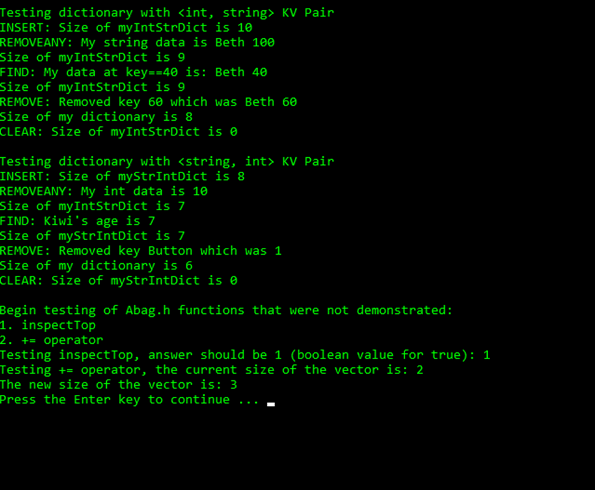

# Goal
Construct a bag dictionary, extending and modifying header files, to create an unordered collection of values that may have duplicates, utilizing smart pointers and vectors.

# Outcome
Successfully implemented the bag dictionary using smart pointers and vectors. 

Running `bagtestmain.cpp`:
