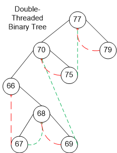
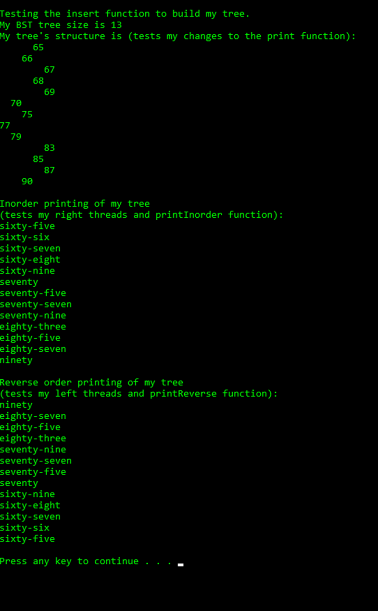

# Goal
Implement a double-threaded binary tree, modifying and extending header files, and making sure to utilize bit fields to optimize memory usage. 

Double threaded: each node is threaded towards both the in-order predecessor and successor (left and right) means all right null pointers will point to the in-order successor AND all left null pointers will point to the in-order predecessor.

This is very useful for efficiently traversing and accessing the ancestors of a node. 

# Outcome 

running `main.cpp`

