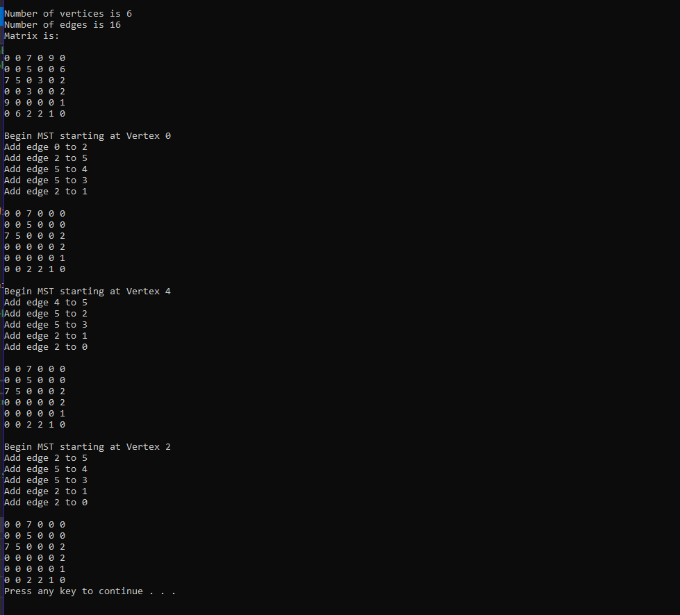

# Goal
Implement two functions: one to read a graph from a file `input.graphfile` and the other to write a graph to a file `output.graphfile`.  T

Implementing a complete MST program that reads an undirected graph from a file, constructs the MST, and then writes to a second file the graph representing the MST in order to test these two functions.  

Utilize smart pointers.

# Outcome

Successfully implemented and ran both functions:
