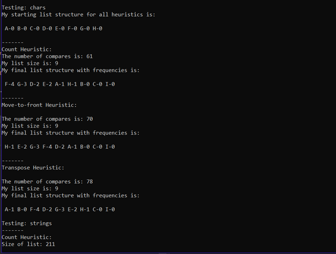
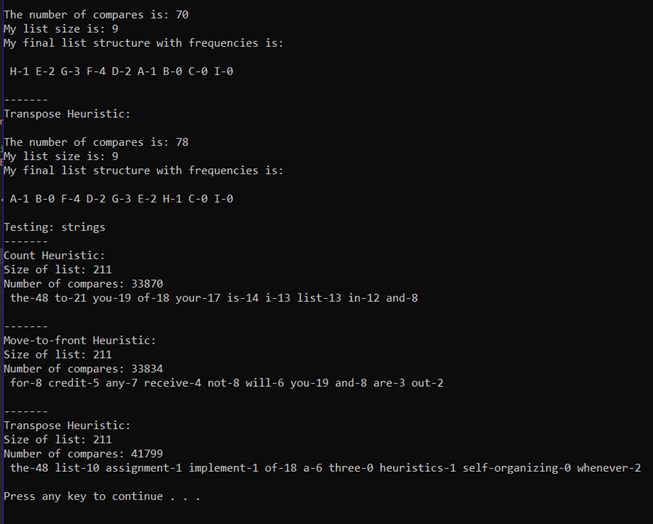

# Goal
Implement the three self organizing list heuristics: 
- Count – Whenever a record is accessed it may move toward the front of the list if its number of accesses becomes greater than the record(s) in front of it.  If the record is not in the list it is added to the back of the list and its count is set to zero.
- Move-to-front – Whenever a record is accessed it is moved to the front of the list.  This heuristic only works well with linked-lists; because, in arrays the cost of shifting all the records down one spot every time you move a record to the front is too expensive.
- Transpose – whenever the record is accessed swap it with the record immediately in front of it provided it is already in the list. If it is not found in the list and is being added to the list for the first time, it goes to the back of the list.

Further compare the cost of each heuristic by keeping track of the number of compares required when searching the list.

Test with char types, then with an inputted text file. 

# Outcome

Char type test:

Text file test:
