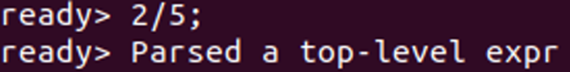
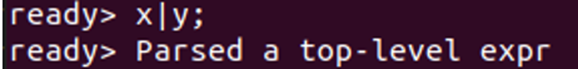
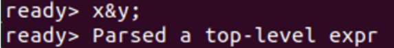
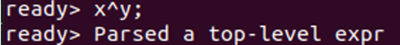
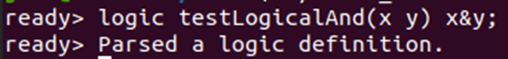
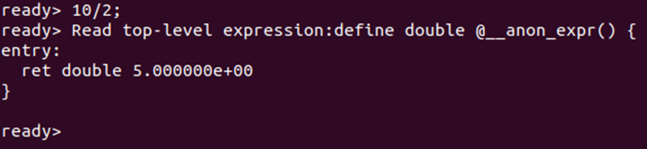
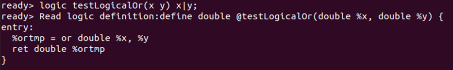
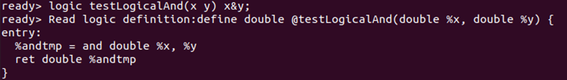
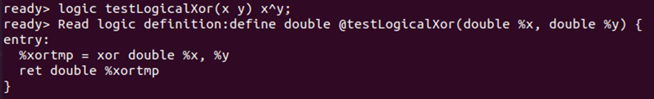
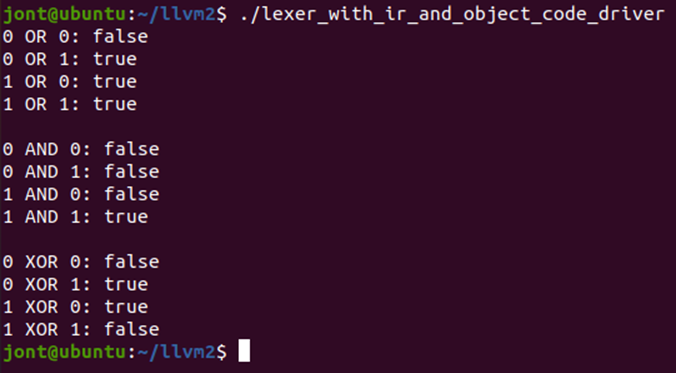

##Goal##
Modify the `lexer_demo.cpp` to allow for the parsing of new expressions. 

Create an Intermediate Representation of these expressions in `lexer_demo_with_ir.cpp`.

Create object code to an external C library (`lexer_with_ir_and_object_code.cpp`) and driver code (`lexer_with_ir_and_object_code_driver.cpp`) to test the new functions: testLogicalAnd(), testLogicalOr(), and testLogicalXor().

expressions: 
- division: `/`
- OR: `|`
- AND: `&`
- XOR: `^`
- Logic command: `logic`

##Outcome##

**Expressions**
- division: `/`

- OR: `|`

- AND: `&`

- XOR: `^`

- Logic command: `logic`

**Intermediate Representation**
- division: `/`

- OR: `|`

- AND: `&`

- XOR: `^`

**Function Driver & Object Code test**

