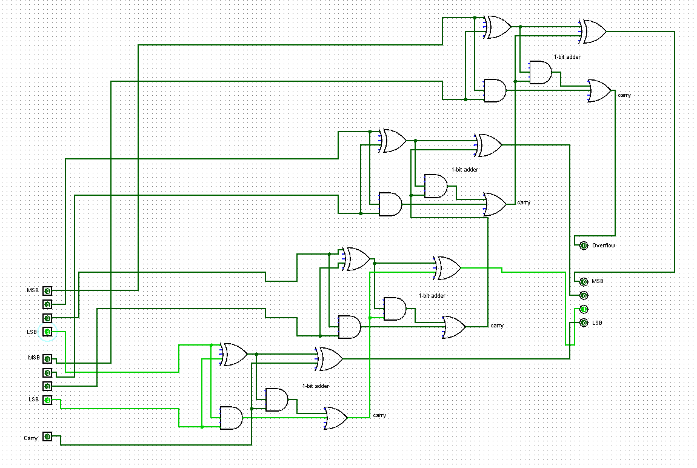
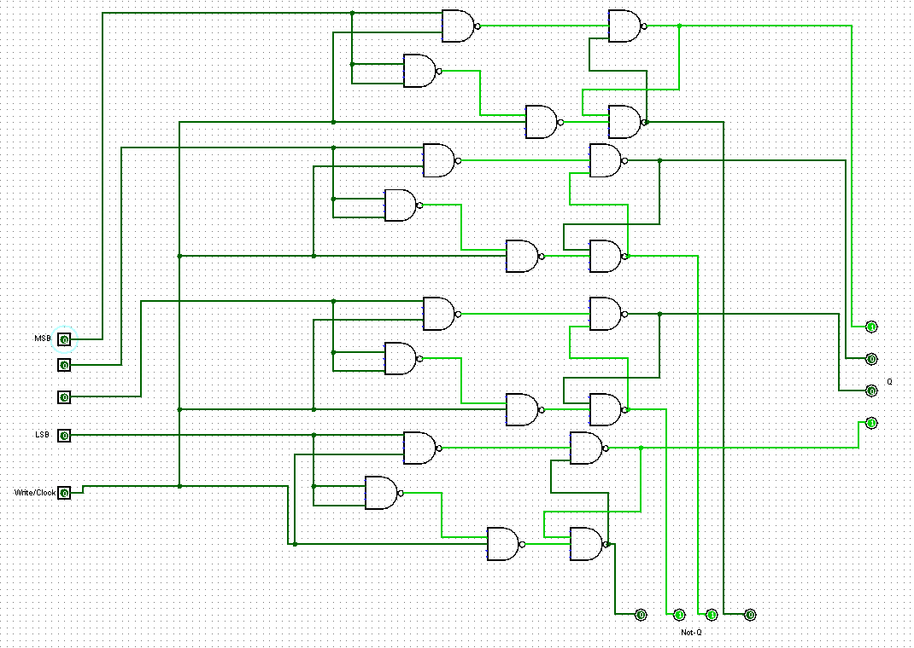
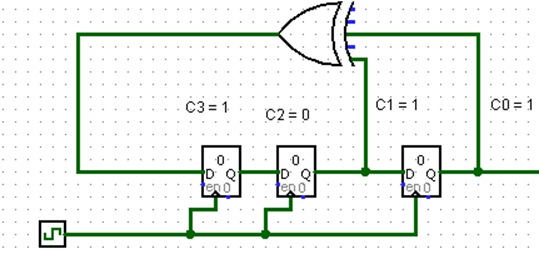
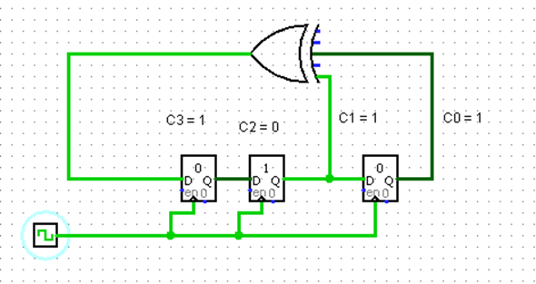
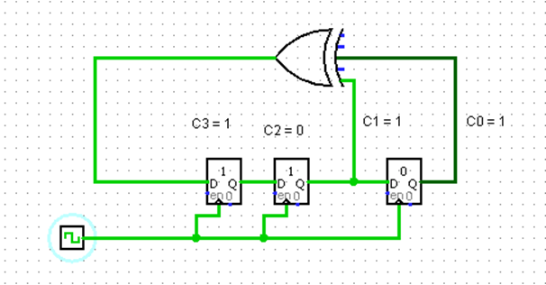

##Goal##
Create 4-bit register, 4-bit adder, and Linear Feedback Shift Register circuits from only logic gates. 

##Outcome##

4-bit adder:

4-bit register:

###LFSR###
A Linear Feedback Shift Register is a method of creating pseudo random numbers by seeding several registers with a particular starting binary value, which is tapped into by one or more XOR gates along the circuit. The results of each XOR is then fed back into the circuit and through the same XOR again. This creates a variety of outputs depending on the seed value and the architecture of the circuit, thereby creating pseudo randomness. The positioning of these XOR gates is extremely important as they change the coefficients of the binary polynomial that represents the circuit. For example, by tapping into the link between the first and second register, this changes the coefficient of the second variable within the binary polynomial to 1, as seen below: 

The binary polynomial representation of Figure 3 is P(x) = x^3 + 0 + x + 1, where ‘x^3’ is the result of there being 3 registers to shift through, and ‘x’ is the result of the XOR gate increasing the coefficient of that variable to 1. The circuit is then seeded with the binary value ‘100’ which leads to the following 5 outputs: 010, 101, 110, 111, 011. Therefore, the binary representation of the polynomial is 1011. This can double be checked by doing regular binary polynomial conversion of the equation P(x) = x^3 + x + 1 which becomes P(x) = 1000 + 0010 + 1 = 1011. 

First iteration: 

Final Iteration: 

