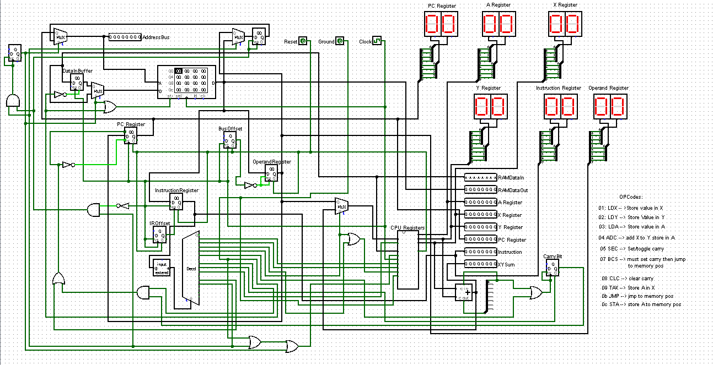
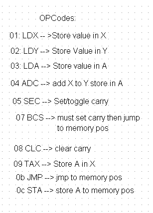

##Goal##
Analyze the opcodes of the 8-bit computer in Logism, construct a program using those opcodes, and create an assembler in C++ that reads in `prog.s` and converst the instructions to opcodes. This program is then uploaded into the 8-bit computer's memory. 

The opcodes for the 8-bit computer were discovered by testing various inputs by loading them into memory and are displayed in the screenshot below. 

The program:
BCS 14
LDA fa
TAX 0
LDY 1
ADC 0
STA 7
JMP 3

##Outcome##
The assembler successfully read in prog.s and outputted a program that could be run in the 8-bit computer, leading to it looping until it met the final condition and exiting the loop. 