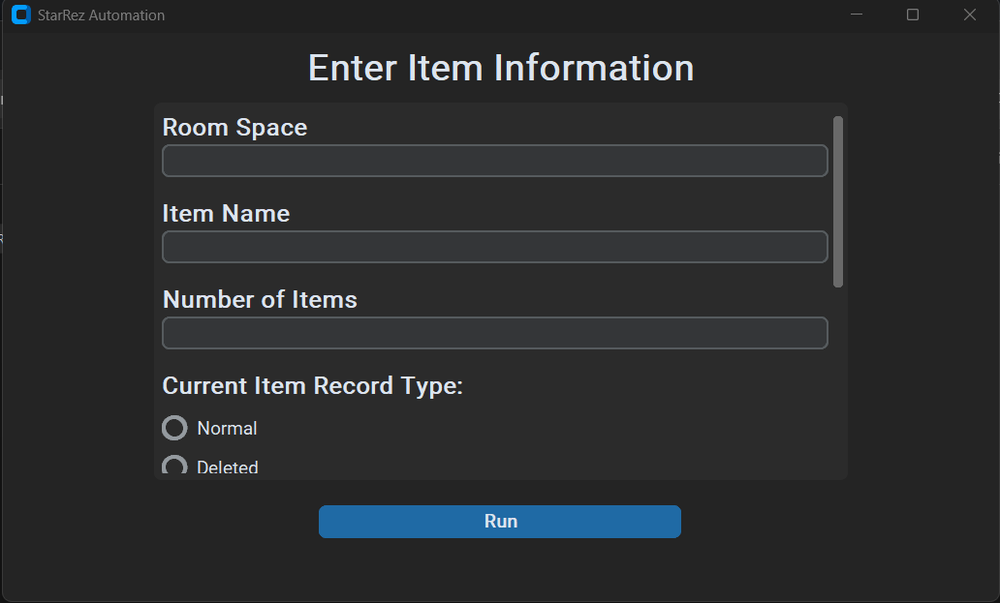

# Problem
My supervisor was required to manually edit, input, and delete hundreds of records in the University's database on a web interface. This took up hours of her time weekly. I pitched that I could automate this process for her. She agreed. 

# Solution
The database was hosted on a web interface. I had no access to any database commands, only this interface. 

Therefore, I chose selenium as my primary way of automating the navigation of this site. 

I multi-threaded the application to allow for multiple automations to be running at once (e.g. deleting 300 chairs from one roomspace, editing the fields of 100 beds in another, etc.). 

I made the app a distributable .exe to be downloaded simply by the end user. 

I crafted a simple GUI using tkinter to allow for these automations to be run by the user: 

# Outcome
The program successfully automated my supervisor's task. Holding the potential to save her hundreds of hours of manual labor. 

However, due to concerns raised by upper management that the database provider may not want a third party service being used on their software, the project was put to rest in order to avoid potential conflicts. 

While this was disappointing, this project still allowed me to see real world practical application of an automation that genuinely benefitted my supervisor in a way that would have freed her up to do more of what she does best. 
